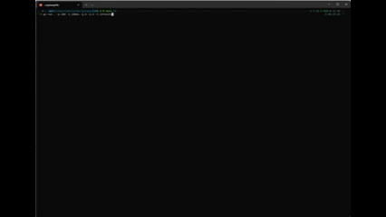

# Go Game of Life

A fast and scalable implementation of Conway’s Game of Life in Go running in the terminal.  
Supports both **boarded boards** and **sparse infinite boards**.

## Features

- Infinite board mode (sparse storage, scales to very large grids).
- Boarded board mode with fixed width/height determined by the widht and height of the terminal.
- Terminal rendering (via [termbox-go](https://github.com/nsf/termbox-go)).
- Keyboard controls for pausing and adjusting speed.
  - pause: \<SPACE\>
  - quit: \<ESC\>
  - speed up/down: +/-
  - pan board with arrows: left, right, up and down 
  - reset board origin: r
- Unicode characters for smooth board visualization.
- Statistics tracking:
    - Generation count
    - Alive cells
    - Born / Died cells per tick

## Run

Clone repo:
```shell
git clone https://github.com/nbu/go-life.git
```

Run code:
```shell
cd go-life
# Get usage info
go run . --help

# Run simulation for 100 generation on the infinite board with 50ms step interval using objects/spaceship/canadagrey.cells initial layout file
go run . -s 50ms -g 100 -t infinite -f objects/spaceship/canadagrey.cells

# Run random board for 1000 generations with 100% population on the infinite board with 10ms step interval
go run . s -p 100 -s 10ms -g 1000 -t infinite
```

## Demo

